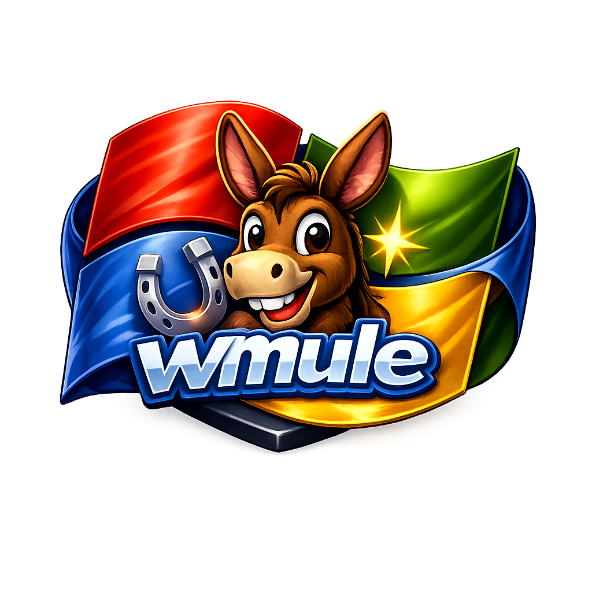

# wMule

<p align="center">
  
</p>

wMule is a Windows 11 x64-focused fork of aMule 2.4.0, modernized with CMake, vcpkg and MSVC 2022.

## Status

- Main GUI client: `wmule.exe`
- Command-line client: `wmulecmd.exe`
- Web adapter: `amuleweb` (optional)
- Build system: CMake + vcpkg + MSVC 2022

## Overview

wMule keeps compatibility with the existing eD2K, Kad and EC protocol stack while hardening parsing, configuration, concurrency and remote control flows.

The project is being modernized incrementally:

- security first
- stability second
- architecture third
- new features later

## Main goals

- Keep the Windows desktop client stable
- Preserve protocol compatibility
- Harden networking, paths and configuration
- Improve concurrency safety and shutdown behavior
- Prepare the codebase for further async and architectural work

## Building

### Configure

```powershell
Set-Location K:\wMule\build
cmake .. `
    -DCMAKE_BUILD_TYPE=Debug `
    -DCMAKE_TOOLCHAIN_FILE=C:/vcpkg/scripts/buildsystems/vcpkg.cmake `
    -DENABLE_UPNP=ON
```

### Build

```powershell
Set-Location K:\wMule\build
cmake --build . --config Debug
```

### Testing

```powershell
Set-Location K:\wMule\build
ctest --output-on-failure -C Debug
```

## Documentation

- `AGENTS.md` — project rules and workflow
- `docs/PLAN_MODERNIZACION_2.0.md` — active roadmap
- `docs/PLAN_MODERNIZACION_COMPLETADO.md` — completed roadmap phases

## Contributing

Contributions are welcome. Please keep changes incremental, preserve protocol compatibility, and validate with build + tests before opening a pull request.

## License

GPL v2 or later
